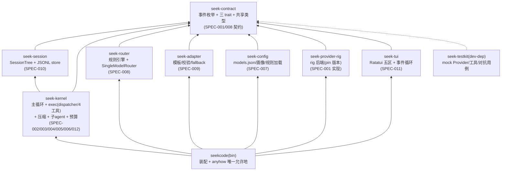
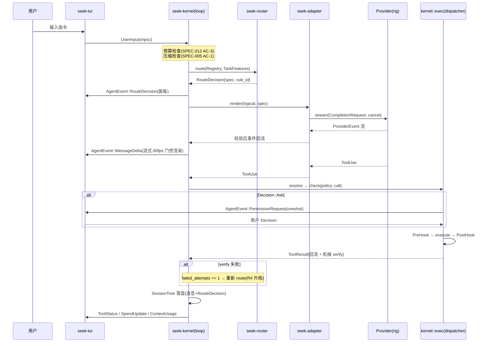
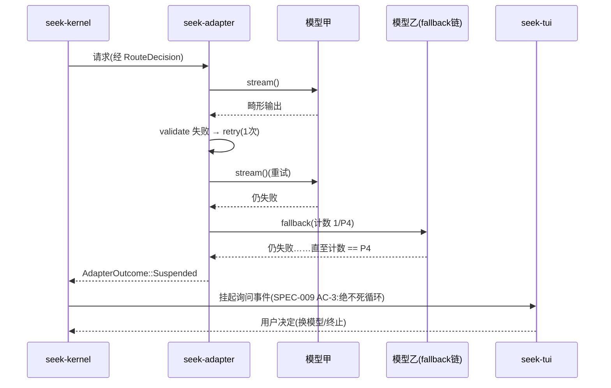

# seekcode 架构文档(ARCHITECTURE)

> 定位:**非规范性**描述文档(宪章 7.1)。规范性约束只存在于宪章与规格(report_v2.md + docs/specs/);本文描述这些约束在代码结构上的落点,冲突时以规格为准。每处设计均标注对应 SPEC 编号。

---

## 1. 系统分层与模块边界

### 1.1 组件图(crate 级)



**依赖方向铁律**(宪章 2.3/5.4 的结构落点,CI 以 `cargo metadata` 白名单断言):

| crate | 允许依赖(内部) | 允许依赖(外部) | 禁止 |
|---|---|---|---|
| seek-contract | — | std, serde, thiserror, tokio(仅 mpsc/oneshot 类型), uuid, chrono | 一切厂商/UI/存储库 |
| seek-kernel | contract, session | std, tokio, serde, thiserror, tracing | **rig/genai/ratatui/crossterm/rusqlite;任何厂商名**(宪章 5.2 词表 grep) |
| seek-session | contract | std, serde, serde_json, thiserror, uuid | 厂商/UI 库 |
| seek-router | contract | std, serde, thiserror, tracing | 厂商 SDK、IO 类库(路由是纯函数,SPEC-008) |
| seek-adapter | contract | serde, serde_json, jsonschema, thiserror, tracing | 厂商 SDK(模板按 ModelSpec 数据驱动,不 import 厂商类型) |
| seek-config | contract | serde, figment, thiserror | — |
| seek-provider-rig | contract | **rig(=x.y.z pin)**, tokio, tracing | 文件/进程类 crate(宪章 5.1:Provider 层无副作用能力) |
| seek-tui | contract | **ratatui, crossterm**, tui-textarea, similar, tokio | kernel 内部类型(只认 `AgentEvent`,宪章 5.4) |
| seekcode(bin) | 全部 | anyhow(唯一允许处,宪章 2.1) | — |

关键点:**kernel 与 tui 互不依赖**——两者只共同依赖 seek-contract,层间通信只经 `AgentEvent`/`ProviderEvent` 枚举(编译期保证反向 import 不可能)。

### 1.2 workspace 结构

```text
seekcode/
├── Cargo.toml                # [workspace] + workspace.lints(宪章 2.1 clippy deny 集)
├── Cargo.lock                # 入库(宪章 2.3)
├── deny.toml                 # cargo-deny license/bans(宪章 2.3)
├── crates/
│   ├── seek-contract/        # #![forbid(unsafe_code)] #![deny(missing_docs)]
│   ├── seek-kernel/
│   │   └── src/
│   │       ├── loop_.rs      # SPEC-002 状态机
│   │       ├── exec/         # SPEC-003 dispatcher + SPEC-004 四工具
│   │       │                 #   Tool::execute 可见性 = pub(in crate::exec)
│   │       ├── compact.rs    # SPEC-005
│   │       ├── subagent.rs   # SPEC-006
│   │       └── ledger.rs     # SPEC-012
│   ├── seek-session/
│   ├── seek-router/
│   ├── seek-adapter/
│   ├── seek-config/
│   ├── seek-provider-rig/
│   ├── seek-tui/
│   └── seek-testkit/         # 仅 dev-dependencies 引用
├── src/main.rs               # bin:装配与启动
├── tests/adversarial/        # SPEC-003 对抗用例集(持续扩充)
└── docs/                     # 宪章/规格/本文
```

### 1.3 主流程时序图(一轮任务)



### 1.4 故障路径时序图(格式失败 → fallback → 挂起)



---

## 2. pi 理念的模块级落点

不做抽象描述,逐条对到 crate/模块/类型:

| pi 理念 | 具体落点 | 机检方式 |
|---|---|---|
| ① 极小内核(4 工具 + 最短提示) | `seek-kernel` 全部内容 = 主循环状态机 + `exec`(dispatcher 与 Read/Write/Edit/Bash)+ 压缩 + 子 agent + 预算;**路由规则、提示模板、能力画像、fallback 链一概不在 kernel**,全在 `seek-config` 加载的外置配置里 | 防腐①(`SingleModelRouter` 换掉 Router 后内核测试全绿)+ kernel 依赖白名单 + 厂商词表 grep |
| ② 能力经 Extension 扩展、状态持久化进 session | MVP 不实现 Extension trait(未立 spec,不得实现);**持久化槽位已留**:`Node.meta`(SPEC-010 契约)是扩展状态的落点,序列化进节点元数据 | SPEC-010 AC-2 往返测试覆盖 meta 字段 |
| ③ 树状 session(分支/rewind/摘要注回) | `seek-session::SessionTree`:`branch_from` / `rewind_to` / `reinject_summary`(SPEC-010);rewind 只回滚对话不回滚文件系统(与 pi 一致,D4 边界) | SPEC-010 AC-1/4/5/7 |
| ④ 模型无关一等公民(factory + compat) | `seek-contract::Provider` trait 唯一出口;`seek-config` 的 `(provider, model, api)` 工厂 + `CompatFlags`(SPEC-007);新增模型 = 只改 `models.json` | 防腐②(mock 厂商零代码接入)+ SPEC-007 AC-2/3 |

本项目对 pi 的**机制增强点**(report_v2 §1.3):在"每个需要 LLM 的节点前"插入路由决策——落点即时序图 1.3 中 `K->>R: route()` 这一步,pi 原生节点流没有这个环节。

---

## 3. 关键技术决策记录(ADR)

### ADR-001:自有 Provider trait,rig 只是第一个后端

- **背景**:rig README 自警未来破坏性变更;genai 单维护者;Rust LLM 生态整体不稳(report_v2 §7)。
- **决策**:`Provider` trait 定义在 seek-contract,`seek-provider-rig` 是其一个实现,rig pin 精确版本且只出现在该 crate。
- **后果**:(+)换库/加厂商不动内核;防腐②可机检。(−)多一层薄适配,rig 的高级特性(agents/pipelines)用不上——我们只消费其 completion+streaming。
- **备选**:直接以 rig 的 `CompletionModel` 为内核抽象——被否:内核会随 rig 破坏性变更被迫改动,违反宪章 2.3/5.2。

### ADR-002:独立 seek-contract 契约 crate

- **背景**:宪章 5.4 要求 kernel 与 TUI 互不 import、层间只经事件枚举;需要编译期强制而非约定。
- **决策**:两枚举、三 trait、共享类型集中于零业务逻辑的 seek-contract;kernel 与 tui 互相不可见。
- **后果**:(+)反向依赖在编译期不可能;契约变更集中体现为一个 crate 的 diff + serde 快照。(−)类型改动的涟漪面变大——这是有意的:契约变更本就该显眼。
- **备选**:kernel 导出公共类型、tui 依赖 kernel——被否:TUI 可触达内核内部,5.4 只能靠纪律维持。

### ADR-003:dispatcher 与内置四工具同 crate(`kernel::exec` 模块)

- **背景**:宪章 5.1 要求 `Tool::execute` 只能经权限校验路径调用,手段是 `pub(in ...)` 可见性——该机制**不能跨 crate**。
- **决策**:dispatcher 与 Read/Write/Edit/Bash 收进 `seek-kernel::exec` 单模块,`execute` 可见性 `pub(in crate::exec)`;对外只暴露 `exec::dispatch(call) -> ToolResult`(内部先 `check`)。
- **后果**:(+)"绕过校验执行工具"编译不过(SPEC-003/004 AC-6 trybuild);(+)与 pi「4 工具在内核」一致。(−)未来第三方工具需另设机制(Extension spec 立项时解决,MVP 无此需求)。
- **备选**:独立 seek-tools crate——被否:可见性约束失效,只能靠评审把关。

### ADR-004:路由层 = 独立 crate + 全配置外置 + 常驻空实现

- **背景**:路由是差异化机制,但其**收益**未验证(FUTURE F1);宪章 5.3 要求可整体摘除。
- **决策**:seek-router 只含规则引擎与 `SingleModelRouter`;规则表、画像、fallback 链全部是 seek-config 加载的数据;`SingleModelRouter` 不是测试桩而是**常驻交付物**(`--router none` 模式)。
- **后果**:(+)防腐①有真实替换体;F1 假设被证伪时产品仍完整。(−)规则表达力受限于数据格式(无任意代码)——MVP 规则 R1–R6 足够,更强表达力等 D3 裁定。
- **备选**:路由逻辑写死在 kernel——被否,违反极小内核与 5.3。

### ADR-005:session 持久化 JSONL 先行,SQLite 后续

- **背景**:report_v2 §6.1 允许 rusqlite 或 JSONL;SPEC-010 已把存储收敛为 `SessionStore` trait 的单后端交付。
- **决策**:首个后端 = 追加式 JSONL(一行一个 `TreeEvent`)。
- **后果**:(+)追加式天然契合"事件日志"模型;崩溃恢复 = 跳过最后半行(SPEC-010 AC-3 直接可测);人类可读、git diff 友好;kernel 依赖白名单不引入 rusqlite。(−)大会话线性重放变慢、无索引——出现实际瓶颈时以 SessionStore 第二实现引入 SQLite,不动调用方。
- **备选**:SQLite 先行——被否:半写检测与 WAL 语义引入的复杂度在 MVP 换不来收益。

### ADR-006:TUI 用 Ratatui 即时模式 + 60fps Render 门控

- **背景**:流式 token 需要完全掌控重绘循环;选型证据见 report_v2 §4.1(Cursive 停滞、tui-realm 社区规模 1/173)。
- **决策**:Ratatui + crossterm 单 EventStream;事件只置脏标记,仅 `Event::Render`(60fps tick)触发 `terminal.draw()`。
- **后果**:(+)渲染节奏与 LLM 流/工具执行解耦,SPEC-011 AC-2/3 可测。(−)自管事件循环,防死锁三规则必须自守(宪章无法编译期强制,靠 SPEC-011 AC 回归)。
- **备选**:Cursive(内建循环,已停滞)、tui-realm 打底(可作后续叠加层,不作地基)——均否。

### ADR-007:单 tokio 运行时,通信全走 mpsc/oneshot

- **背景**:crossterm 阻塞 read 非线程安全;不能在同线程同时 await API 与 poll 终端(report_v2 §4.3 实证)。
- **决策**:一个多线程 tokio 运行时;LLM 流、子 agent、事件源各为独立 task;Terminal 单一所有者;跨 task 零共享可变状态,权限问答走 oneshot。
- **后果**:(+)死锁面收敛为"是否遵守三规则",各 AC 可回归;取消语义统一(CancellationToken 树)。(−)所有交互异步化,同步式单测需 `tokio::test` 与虚拟时间。
- **备选**:UI 独立 OS 线程 + channel 桥接——不必要,select! 惯用法已被 Ratatui 官方与 claux/pi_agent_rust 双实证。

### ADR-008(未决,系于行动项 #0):借鉴 vs fork `pi_agent_rust`

- **背景**:pi_agent_rust 覆盖 MVP 步骤 1–4、6 的大量地形,但其许可证与"授权移植"条款未核实(宪章行动项 #0)。
- **决策**:**暂缓**。默认路线为"借鉴重写"(本文全部结构不依赖 fork);若 #0 核实许可证兼容且代码质量达标,可议改道 fork,届时补 ADR-008 终版并重估 crate 划分。
- **后果**:当前架构按自研成本估算(6–8 人周),fork 若可行则是纯上行期权。
- **备选**:先 fork 后补核实——被否:license 风险不可回滚。

---

## 4. 与治理文档的挂钩

- 本文的依赖方向表(§1.1)是宪章 2.3「白名单文件」的**人类可读版**;机检以 `cargo metadata` 断言脚本 + 入库白名单为准,两者不一致时修脚本或修本文,以宪章为最终仲裁。
- 每个 ADR 的推翻或修订:普通 ADR 追加"被 ADR-0xx 取代"标记即可;若涉及宪章条款(如 ADR-003 动可见性策略),同步走宪章 6.2。
- 本文不含任何"必须/不得"级新约束——出现即属违章(宪章 7.1 检查),应迁移至宪章或规格。

## 修订记录

| 版本 | 日期 | 变更 |
|---|---|---|
| 1.0 | 2026-07-02 | 初版:crate 划分、时序、pi 理念落点、ADR-001–008 |
