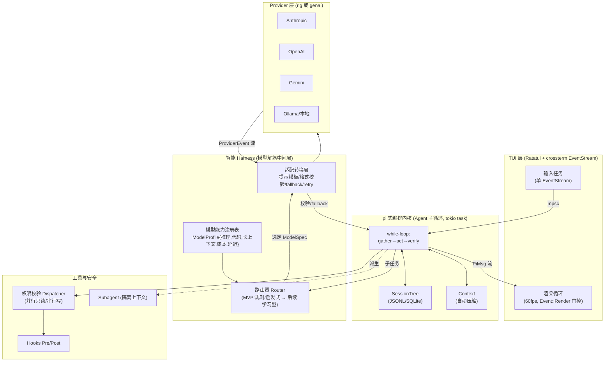

# 深度技术调研报告：基于 pi 理念 + 智能 Harness 的 Rust 全栈编码 Agent

> 目的：评估并指导一个「以 pi 式轻量编排为内核 + 模型解耦的智能 Harness + Rust TUI」的本地编码 Agent 是否进入工程实现阶段。
> 方法：两轮对抗式深度调研（106 + 89 个子 agent，3 票验证制，2/3 反驳才剔除一条论断）。证据等级标注为「主源/二手/博客」，关键结论附引用。
> 结论先行：**值得进入工程实现**。目标架构有强先例支撑（pi 自身、pi_agent_rust、Claude Code、RouteLLM），Rust 生态已具备落地条件，且现有方案（Aider/Continue/OpenInterpreter/DSPy/LangChain/AutoGen/CrewAI）**无一具备「按 query 在线、能力感知地路由模型」的智能 Harness**——这正是本项目的差异化所在。

---

## 0. 一页摘要（TL;DR）

| 维度 | 结论 |
|---|---|
| **可行性** | 高。pi 已自称 "agent harness"，四包单仓架构（pi-ai / pi-agent-core / pi-coding-agent / pi-tui）直接映射目标分层。已有授权 Rust 移植 `pi_agent_rust`（v0.1.18, 2026-06）可参考/借鉴。 |
| **理论支撑** | Claude Code ≈ 1.6% 决策逻辑 + 98.4% 运营 Harness；"推理/执行分离"是模型无关、可复刻的核心范式。Anthropic「Managed Agents」三件套（session/harness/sandbox 虚拟化）给出避免模型锁定的设计骨架。 |
| **差异化** | 现有 7 个对标工具**全部是设计期静态绑定模型**（per-agent / per-role），没有一个做 RouteLLM 式「按 query 在线能力路由」。这是本项目的独特价值。 |
| **路由可行性** | RouteLLM 证明可行：MT Bench 上 >85% 成本下降、保留 95% GPT-4 质量，且能跨模型对泛化。**但 MVP 应先用规则/启发式路由器**，学习型路由是后续增强。 |
| **TUI 选型** | **Ratatui**（~1763 万下载，v0.30.0 / 2025-12，活跃多维护者）。Cursive 已停滞（最后版本 2024-08），tui-realm 生态仅为 Ratatui 的 ~1/173。 |
| **LLM 后端** | **rig**（统一 Provider trait，20+ 厂商，流式+工具调用，最成熟）或 **genai**（25+ 厂商原生协议，单维护者）。二选一作为 Provider trait 基座。 |
| **第一步** | 定义 `Provider` trait + 单模型 agent 主循环，流式接入 Ratatui 事件循环。约 1–1.5 人周可见首个端到端 demo。 |

---

## 1. pi 架构剖析与可映射的设计原则

### 1.1 架构事实（主源验证，3-0）

pi 是 **四包单体仓库**（`pi-monorepo`, `workspaces: packages/*`），README 头即 `## Pi Agent Harness`：

| 包 | 职责 | 映射到目标分层 |
|---|---|---|
| `pi-ai` | 统一多厂商 LLM API（74 个 TS provider 文件 + 形式化 `ProviderStreams` 统一流接口） | **Provider 层** |
| `pi-agent-core` | Agent 运行时：工具调用 + 状态管理 | **编排内核 / Agent 主循环** |
| `pi-coding-agent` | 交互式编码 CLI | **应用层** |
| `pi-tui` | 终端 UI（差分渲染） | **TUI 层** |

来源：`github.com/earendil-works/pi`、`lucumr.pocoo.org/2026/1/31/pi/`（Armin Ronacher 解析）。

### 1.2 "轻量"的本质（3-0）

- **极小内核**：被称为「已知 agent 中最短的系统提示」，**仅 4 个工具 Read/Write/Edit/Bash**。
- **扩展系统补偿**：能力靠 extension 扩展，且 **extension 可把状态持久化进 session**。
- **树状 Session**：消息带 `id/parentId`，支持分支/导航/侧任务（side-quest）——在分支里修好坏掉的工具，再 rewind 并把分支摘要注回主线（`branch_summary` 注入）。
- **模型无关是一等公民**（关键，3-0）：Ronacher 原文「一个 session 真的可以包含来自许多不同模型厂商的消息……它不会过度依赖任何无法迁移到其它厂商的模型专属特性。」请求经 **provider factory** 用 `(provider, model, api)` 三元组解析后端；用户在 `models.json` 自定义 provider（model id / base URL / api 类型 / compat flags）；compat 配置吸收 OpenAI 兼容差异（`system_role_name`、`max_tokens_field`、`supports_tools`、`supports_streaming`、`custom_headers`）。

### 1.3 局限性（面向智能路由）

1. **无在线能力路由**：`(provider, model, api)` 是**用户/会话级**选择，不是按 query 难度自动选模。pi 把「选哪个模型」留给用户。
2. **节点流偏线性/树状对话**，没有「在节点间插入路由决策」的内建抽象——这正是本项目要补的增强点。
3. **`/tree` 仅回滚对话状态，不回滚文件系统改动**（StackToHeap 指出）——若要真正隔离的 side-quest，需自己加文件快照/沙箱。

### 1.4 可直接映射为 Rust 内核的设计原则

| pi 理念 | Rust 落地原则 |
|---|---|
| 极小内核 + 扩展 | `Tool` trait + `Extension` trait；核心只保留 4 工具，其余动态注册 |
| 模型无关 + factory + compat | `Provider` trait + `ModelSpec{provider,model,api,compat}` + `models.json` 反序列化（serde） |
| 统一流接口 ProviderStreams | `Provider::stream() -> mpsc::Receiver<ProviderEvent>`（见 §4.3） |
| 树状 session | `SessionTree`（节点 `id/parent_id` + active leaf），SQLite/JSONL 持久化 |
| 状态可持久化进 session | 扩展状态序列化进节点元数据 |

---

## 2. Claude Code "Harness" 能力解构与 Rust 映射

### 2.1 核心范式（主源 + arXiv，多数 3-0）

- **简单 while-loop**：核心是 `queryLoop()` 异步生成器——调模型→跑工具→重复。**约 1.6% 是 AI 决策逻辑，约 98.4% 是运营 Harness 基础设施**（Tier-C 重建证据，方向性可靠，精确比值非同行评审）。设计哲学：投资**确定性基础设施**（上下文管理、工具路由、权限执行、恢复），而非决策脚手架（planner/状态图）。随前沿模型收敛，**Harness 质量成为主要差异化**；Harness 是"为模型创造做对决定的条件"，而非"约束模型选择"。来源：`arxiv.org/html/2604.14228v1`、`anthropic.com/engineering/managed-agents`。
- **三阶段主循环**：gather context → take action → verify results，可重复、可人为中断。**让 agent 之所以"agentic"的是工具而非模型尺寸**——每次工具调用的返回喂入下一次决策。内建工具分五类：文件操作 / 搜索 / 执行 / Web / 代码智能。来源：`code.claude.com/docs/en/how-claude-code-works`、`.../agent-sdk/agent-loop`。

### 2.2 安全：推理与执行分离（强耦合点其实是可复刻的范式）

> arXiv 原文：「因为推理与执行占据**不同的代码路径**，被攻陷或被对抗操纵的模型无法越过 sandbox、权限检查或 deny-first 规则。」

模型**从不直接访问** FS/shell/network，只发 `tool_use` 块，由 Harness 校验+派发。这是**模型无关**的可复刻设计（CVE-2025-59536 等利用的是信任初始化窗口，不是模型越权，架构论点成立）。

### 2.3 工具执行与上下文管理

- **并行只读 / 串行写**：只读工具（Read/Glob/Grep/只读 MCP）并发执行；改状态工具（Edit/Write/Bash）强制串行；自定义工具默认串行，除非标 `readOnlyHint`。
- **权限层 + Hooks**：`allowed_tools`/`disallowed_tools`/`permission_mode` + `PreToolUse`/`PostToolUse` 宿主进程 hook，可在上下文窗口之外拦截/改写/阻断任意工具调用。
- **自动压缩 + 子 agent**：临近上下文上限自动摘要旧历史（发 `compact_boundary`）；子 agent 全新对话、只把最终响应返回父级，把父级上下文增长界定在"摘要"而非"全量转录"。

### 2.4 哪些与 Claude 强耦合 / 哪些通用

| 能力 | 耦合度 | Rust 通用化方案 |
|---|---|---|
| while-loop 主循环 | **通用** | tokio task 驱动 loop：调 Provider→解析 tool_use→`Tool` trait 执行→追加结果→检查停止条件，全程可取消 |
| 推理/执行分离 | **通用** | 工具执行置于权限校验 dispatcher 之后，`Provider` trait 无法绕过 |
| 并行只读/串行写 | **通用** | `Tool { readonly: bool }`；只读批用 `tokio::join!`，写操作顺序 `await` |
| Hooks (Pre/Post) | **通用** | hook 闭包系统，运行在 Provider 上下文之外 |
| 自动压缩 | **通用** | `Context` trait + `compact()` |
| 子 agent 隔离 | **通用** | `Subagent` 抽象：spawn 独立 agent-loop task，仅返回最终 tool-result |
| 具体系统提示 / tool_use 块的 Anthropic 格式 | **强耦合** | 由 `Provider` 适配层吸收（compat flags + 适配器），不进内核 |

### 2.5 Anthropic「Managed Agents」——避免模型锁定的骨架（3-0）

> 「我们把 agent 的组件虚拟化：**session**（追加式事件日志）、**harness**（调模型 + 路由工具调用的循环）、**sandbox**（执行环境），使每个实现可被替换而不扰动其它。」
> 「**Harness 编码了关于"Claude 自己做不到什么"的假设；但这些假设会随模型变强而过时，必须频繁质疑。**」

这是本项目「智能 Harness 不能成为新的模型强绑定」的设计圣经：**路由规则、提示模板、fallback 逻辑必须是可替换插件，而非硬编进内核。**

---

## 3. 智能 Harness 层设计（融合 Agent 主循环）

### 3.1 总体架构（Mermaid）



### 3.2 模型能力画像与自动注册

```rust
struct ModelProfile {
    spec: ModelSpec,              // (provider, model, api, compat)
    reasoning: f32,               // 0..1 量化推理
    code_gen: f32,                // 代码生成能力
    context_window: u32,          // 长上下文 token 数
    cost_in: f32, cost_out: f32,  // $/Mtok
    latency_p50_ms: u32,          // 延迟画像
    supports_tools: bool,
    supports_streaming: bool,
}
```

**填充策略（这是智能 Harness 的核心、也是当前最大开放问题）：**
1. **静态配置兜底**（MVP）：`models.json` 手填 + 社区 benchmark 表（沿用 Aider 的 ModelSettings 思路，但加入能力维度）。
2. **provider 元数据查询**：上下文窗口、工具支持等可从 provider API/已知表读取。
3. **在线轻量探针**（后续）：用小样本任务实测 code_gen/latency，回写画像。

> ⚠️ 防过时机制（呼应 §2.5）：画像与路由规则放在**可热替换的配置/插件**里，不进内核；定期质疑「这条假设是否因模型变强而失效」。

### 3.3 任务拆分与模型路由策略（沿用 pi 节点流 + 插入路由决策）

在 pi 的节点流中，**每个需要 LLM 的节点前插入一个 Router 决策点**：

```
[用户输入] → [拆分/规划节点] → ┌─ Router ─→ [起草:小模型]
                                │            ↓
                                └─ Router ─→ [精修:大模型] → [工具调用] → [验证] → 流式返回
```

**MVP 路由器 = 规则/启发式（务实首选）：**
- 按能力标签 + 成本档：`if task.kind == Draft && est_difficulty < θ → 小模型；else → 大模型`。
- 难度估计可用廉价信号：prompt 长度、是否含代码、关键词、所需上下文规模。

**后续增强 = 学习型路由（RouteLLM 已证可行，3-0）：**
- LMSYS RouteLLM：在 Chatbot Arena 偏好数据上训练的路由器，**MT Bench 成本↓>85%、MMLU↓45%、GSM8K↓35%**，保留 95% 质量；且**对未见模型对（Claude 3 Opus/Sonnet、Llama 3.1 70B/8B）零样本泛化**。
- ⚠️ **被否决的相邻论断（0-3）**：「单模型路由可达 3.66x 节省」缺支撑——那是 2-router 强/弱配置，不是级联/集成。**不要引用级联节省数字。** 数字也偏旧（2024-07，GPT-4 Turbo/Mixtral），属历史证据非当前 SOTA。

### 3.4 适配转换层（多模型协作）

| 机制 | 实现 |
|---|---|
| 提示模板转换 | 每 ModelSpec 绑定模板（借鉴 DSPy 的 Adapter：同一 Signature 渲染成 Chat/JSON/XML） |
| 输出格式校验 | serde + JSON schema 校验；失败触发 retry/fallback |
| fallback/retry | 路由失败/格式不符 → 降级到兜底模型（类似 AutoGen 的 positional failover，但加能力感知） |
| 小模型起草+大模型精修 | 复刻 Aider architect 模式（architect 提方案 → editor 落编辑），但**路由是动态的**而非静态表 |
| 工具调用兼容 | 借鉴 Continue 的 system-message tools：无原生 function-calling 的模型，把工具序列化成 XML 进系统提示再解析 |

### 3.5 如何确保 Harness 不成为新的模型强绑定

1. **三层虚拟化**（Managed Agents）：session / harness / sandbox 各自 trait 化、可独立替换。
2. **路由规则、提示模板、能力画像全部外置**为配置/插件，内核不含任何模型专属常量。
3. **Provider trait 是唯一出口**，compat flags 吸收差异，新增模型只需加配置不改代码。
4. **定期"假设审计"**：把"为什么这条路由/提示存在"写进注释，随模型升级复查。

---

## 4. Rust TUI 交互层方案

### 4.1 选型对比（主源 crates.io 数据，3-0）

| 库 | 下载量(总/近期) | 最新版/日期 | 模型 | 事件循环 | 评价 |
|---|---|---|---|---|---|
| **Ratatui** ✅ | **17.63M / 5.37M** | v0.30.0 / 2025-12-26 | 即时模式(immediate) | **用户自管**(双缓冲差分重绘) | 主流、多维护者、活跃；fork 自 tui-rs |
| Cursive | 1.47M / 232K | v0.21.1 / 2024-08-03 | 保留模式(retained) | 内建事件循环 | 单维护者，~2 年发版间隔，**已停滞** |
| tui-realm | 180K / 31K | v4.0.0 / 2026-04-18 | Elm/MVU(**叠在 ratatui 之上**) | 组件化 | 加结构但生态仅 ratatui 的 ~1/173 |

**推荐：Ratatui。** 理由：
- 唯一拥有大型活跃社区（近期下载比 tui-realm 多 ~173x，比 Cursive 多 ~23x）。
- 即时模式 + 双缓冲差分重绘 = **对流式 token 逐字更新最友好**，完全掌控重绘循环。
- 官方 async 模式（crossterm event-stream）是文档化的惯用法。
- Cursive 的内建事件循环反而抽象掉了驱动流式更新所需的循环；且已停滞。
- 若想要 Elm 结构，可在 Ratatui 之上叠 **boba / tears / tui-realm**（见 §4.3），无需放弃 Ratatui 渲染器。

### 4.2 TUI 布局设计

```
┌─ seekcode ───────────────────────────── model: auto │ ctx: 42% ─┐
│ ┌─ 对话流 ────────────────┐ ┌─ 任务/子任务步骤 ──────────────┐ │
│ │ user: 重构 auth 模块     │ │ ▸ 1. 读取 auth.rs   ✔          │ │
│ │ agent: 我先读取……       │ │ ▸ 2. 规划改动 [小模型起草]    │ │
│ │ ▎(流式 token……)         │ │ ▸ 3. 应用编辑 [大模型精修]◐  │ │
│ └─────────────────────────┘ │ ▸ 4. 跑测试        ⋯          │ │
│ ┌─ 工具调用日志 ──────────┐ └────────────────────────────────┘ │
│ │ Read(auth.rs) ✔ 0.2s    │ ┌─ 模型路由决策 ────────────────┐ │
│ │ Bash(cargo test) ◐      │ │ task#2 draft→haiku  ($0.001)  │ │
│ └─────────────────────────┘ │ task#3 refine→opus  难度0.81 │ │
│ ┌─ 代码/文件 Diff 预览 ───────────────────────────────────────┐ │
│ │  - fn login(u,p) {            + fn login(creds: Creds) {     │ │
│ └─────────────────────────────────────────────────────────────┘ │
│ > 输入指令…                                          [Ctrl+C 取消] │
└──────────────────────────────────────────────────────────────────┘
```

五大区：对话流 / 任务步骤树 / 工具调用日志 / Diff 预览 / **模型路由决策面板**（本项目独有，展示每个子任务选了哪个模型、成本、难度分）。

### 4.3 异步事件循环协调（避免渲染阻塞，3-0 多条）

**核心三规则（防死锁）：**
1. **Terminal 单一所有者**：`terminal.draw()` 是唯一同步边界，一个循环迭代只能调一次（双缓冲会覆盖，FAQ 确认）。
2. **一切跨任务通信走 mpsc/oneshot**，绝不在 Terminal 上共享可变状态。
3. **后台工作（LLM 流式、子 agent）作为分离 tokio task**，只通过发消息回 UI，长工具调用永不阻塞渲染节奏。

**惯用模式（官方教程）：**
```rust
// Tui 持有 Terminal + mpsc；spawned task 跑 tokio::select! 多路复用：
tokio::select! {
    maybe_event = crossterm_event => { tx.send(Event::Key(..)) }
    _ = tick_interval.tick()   => { tx.send(Event::Tick) }    // 1 Hz
    _ = render_interval.tick() => { tx.send(Event::Render) }  // 60 fps
}
// 主循环：仅当收到 Event::Render 才 terminal.draw() —— 渲染节奏与输入/后台解耦
```

**真实编码 Agent 的流式协调（claux「Rust 重写 Claude Code」博客，3-0）：**
```rust
// 不能在同一线程同时 await API 和 poll 终端 → 用 select! 多路复用
tokio::select! {
    Some(ev) = api_rx.recv() => match ev {            // Provider::stream() 返回 mpsc::Receiver<ApiEvent>
        ApiEvent::Text(t) => { app.buf.push_str(&t); terminal.draw(|f| ui(f, app))?; }
        ApiEvent::ToolUse{..} => { /* 派发到权限 dispatcher */ }
        ApiEvent::Done => break,
    },
    _ = sleep(Duration::from_millis(50)) => {          // 另一臂轮询输入
        if event::poll(Duration::ZERO)? { /* Ctrl+C 取消、滚动 */ }
    }
}
// 权限提示：engine 在 oneshot channel 上阻塞，直到 TUI 回答
```

> ⚠️ crossterm 的阻塞 `read()/poll()` **非线程安全、不可与 EventStream 混用**（官方文档）。**所有终端输入必须经单个 EventStream**，否则死锁/卡顿。

**可选 Elm 框架**（叠在 Ratatui 上，非必需）：`boba`（bubbletea 风格，`Command::perform` 接 tokio）、`tears`（含 Subscriptions/Commands，可订阅 ws/http）。pi_agent_rust 用的是 `charmed_rust`（Bubble Tea 的 Rust 重写），并以 mpsc + 事件变体 + 60fps + 三级 MemoryMonitor（Normal<80% / Pressure 80-95% 折叠工具输出 / Critical>95% 截断压缩）实现 async-TUI 协调——**这套模式可直接搬到 Ratatui**。

---

## 5. 与现有方案对比，确立项目独特性

**核心论点（全部 high，验证通过）：现有 7 个工具无一具备「按 query 在线、能力感知的模型路由」。它们都是设计期静态绑定。** 本项目的「pi 基座 + 独立智能 Harness + Rust TUI」是空白点。

| 工具 | 多模型机制 | 是否在线能力路由？ | 与本项目的根本差异 |
|---|---|---|---|
| **Aider** | architect/editor 两模型 + weak-model 辅助（commit/摘要） | ❌ 静态 `ModelSettings` 表（model→{edit_format, weak_model, editor_model}） | 两步流水线固定；唯一动态的是 repo-map 的图排名 token 分配（**上下文选择**非模型路由） |
| **Continue** | config.yaml 把模型静态绑到 roles（chat/edit/apply…） | ❌ 工具支持是**硬编码 per-provider 查找表**（`PROVIDER_TOOL_SUPPORT`） | 模型由用户在 UI 选；"路由"外包给 ClawRouter 等**外部 provider**；能力声明只能加不能覆盖 |
| **Open Interpreter** (Rust, Codex fork) | 可插拔"harness"模板（native/claude-code/kimi/qwen…），`/harness` 手动切 | ❌ 每会话单模型单 harness，`/model` `/harness` 手动切换 | **理念最接近**（"emulate harness to extract best from low-cost models"）——但**手动切换，无自动路由**。值得重点参考其 harness 模板思想 |
| **DSPy** | `dspy.LM` 统一抽象(LiteLLM)，可 per-module `set_lm()` | ❌ 全局单默认 LM；多 LM 仅靠手动 per-predictor 赋值 | 智能在**优化期**（MIPROv2 贝叶斯优化提示/demo、GEPA/SIMBA 反思），是**单目标 LM 的提示编译**，非在线选模 |
| **LangChain/LangGraph** | conditional edges / 已弃用的 RouterChain | ❌ 路由函数是开发者手写的纯 Python；框架不发路由器模型 | 提供"管道"（edges）不提供"训练好的路由器" |
| **AutoGen** | `config_list` 位置式 failover；SelectorGroupChat | ❌ 用首个可用模型，失败才试下一个；Selector 路由的是**发言 agent** 不是模型 | "无隐藏逻辑挑最优模型，是开发者责任"（官方原文） |
| **CrewAI** | 每 agent 构造期一个 `llm`（默认 gpt-4），delegation 把 peer 转成 tool | ❌ 唯一"拆分"是 `llm`(推理) vs `function_calling_llm`(工具)——功能划分非难度划分 | role 命名的 peer-tool 委派，无"是否该升级到更强模型"的步骤 |

**结论：** 要 RouteLLM 式按 query 能力路由，在以上任何框架里**都得自己加一个显式路由组件**。它们提供 per-agent llm / edges / selector 等插槽，但**不提供训练好的路由器**。RouteLLM 证明能力路由本身是个**可学习组件**——这正是本项目智能 Harness 要内建、而对标工具都缺失的东西。OpenInterpreter（Rust 版）的 harness 模板与"压榨低成本模型"理念最值得借鉴，但它停在手动切换。

---

## 6. 技术栈与 MVP 路线图

### 6.1 Rust 技术栈推荐

| 关注点 | 推荐 | 说明 |
|---|---|---|
| **Provider 抽象** | **rig** (0xPlaygrounds/rig, v0.36.0) 或 **genai** (v0.6.0) | rig：统一 `CompletionModel` trait，20+ 厂商，流式+工具，已有生产用户（VT Code/Con/ilert 用它做编码 agent 的 provider 层）。genai：原生协议，25+ 厂商/200+ 模型，含 tool_choice/结构化输出/prompt-cache，但**单维护者**、定位"薄客户端"。⚠️ rig README 自警"未来有破坏性变更" |
| 备选/本地 | `ollama-rs`（仅本地 Ollama 单后端）、`mistral.rs`（**推理引擎**，提供 OpenAI/Anthropic 兼容服务端，是被 rig/genai **消费**的对象，非 provider 抽象） | 类别区分：mistral.rs 在"模型服务"侧，不是 provider 抽象 |
| 不可用 | `async-openai`（仅 OpenAI 规格，需自写 Anthropic/Gemini 适配）、`llm`(rustformers, **已归档 2024-06**)、`kalosm`(本地优先全框架，云覆盖小) | |
| 异步运行时 | **tokio**（select!/spawn/mpsc/oneshot） | 全栈异步基座 |
| TUI | **ratatui** + **crossterm**(event-stream) | §4 |
| 文本输入 | `tui-textarea` | 多行输入（rust-code 同款） |
| 配置 | `serde` + `figment` 或 `config` + `models.json` | compat flags / 能力画像反序列化 |
| 持久化 | `rusqlite`(SQLite) 或 JSONL | 树状 session（pi_agent_rust 同款双轨） |
| 日志/追踪 | `tracing` + `tracing-subscriber` | 路由决策、token 用量结构化日志 |
| 错误 | `thiserror`(库) + `anyhow`(应用) | |
| Diff | `similar` | Diff 预览渲染 |
| 测试 | `cargo test` + `insta`(快照) + `wiremock`/mock provider | 路由器/格式校验单测；mock LLM 端到端 |

### 6.2 MVP（验证核心价值）

**端到端目标：** 用户输入 → pi 式编排流转 → 智能路由到多模型 → 工具调用 → 流式返回 → TUI 完整呈现（含路由决策面板）。

**分步计划与工作量估算（单人，粗估）：**

| 步 | 模块 | 内容 | 工作量 |
|---|---|---|---|
| **1（第一步）** | Provider trait + 单模型循环 | 定义 `Provider::stream() -> mpsc::Receiver<ProviderEvent>`；接 rig/genai 单厂商；最小 agent while-loop；流式接入 Ratatui（select! 模式） | **1–1.5 周** |
| 2 | 工具 + 权限 dispatcher | `Tool` trait（Read/Write/Edit/Bash）+ 并行只读/串行写 + Pre/Post hook | 1 周 |
| 3 | TUI 五区布局 | 对话流/步骤树/工具日志/Diff(similar)/路由面板；60fps 渲染门控 | 1–1.5 周 |
| 4 | 多 Provider + ModelSpec/compat | `models.json` + factory + compat flags；2-3 个厂商（含本地 Ollama） | 0.5–1 周 |
| 5 | **规则路由器 + 能力画像** | `ModelProfile` 静态注册 + 启发式路由（难度估计→draft/refine）+ 路由决策日志/面板 | 1 周 |
| 6 | 适配/fallback + session 持久化 | 格式校验(serde)+retry/fallback；树状 session(SQLite/JSONL)+自动压缩雏形 | 1–1.5 周 |

> 总计约 **6–8 人周**到可演示的差异化 MVP。**强烈建议先研读/借鉴 `pi_agent_rust`**（授权移植，clap CLI + agent loop + mpsc 解耦 TUI + 10 provider 模块 + QuickJS 扩展 + JSONL/SQLite + `(provider,model,api)` factory）——可大幅降低步骤 1-4、6 的风险，甚至可 fork 起步。

### 6.3 明确的第一步

**定义 `Provider` trait 并跑通"单模型 agent 主循环 → 流式 token 进 Ratatui"。** 这一步：
- 锁定 §4.3 的 select! 协调骨架（最高技术风险点，先消除）。
- 验证 rig vs genai 选型（实测流式+工具调用）。
- 产出可见的端到端 demo，为后续所有模块奠定接口契约。

---

## 7. 潜在风险与开放问题

### 7.1 风险与缓解

| 风险 | 评估 | 缓解 |
|---|---|---|
| **Rust LLM 生态成熟度** | 中。rig 自警破坏性变更；genai 单维护者；async-openai 仅 OpenAI | 把 Provider trait 设为**自有抽象**，rig/genai 仅作其一个实现，可随时替换；pin 版本 |
| **异步 TUI 死锁/卡顿** | 中→低（有成熟范式） | 严守 §4.3 三规则：Terminal 单所有者、全 mpsc/oneshot、后台 detached task；crossterm 单 EventStream |
| **多模型切换的安全** | 中 | 复刻推理/执行分离：工具执行在权限 dispatcher 之后，任何模型都无法绕过 deny-first；本地模型同样经 sandbox |
| **成本失控** | 中 | 路由决策面板实时显示成本；token 用量 tracing；规则路由器设成本档上限；自动压缩控上下文 |
| **被否决论断的误用** | — | 不引用"3.66x 单模型节省"（0-3 否决）；RouteLLM 数字标注为 2024-07 历史证据 |
| **复杂度失控** | **最大风险** | 死守 pi"极小内核"哲学：内核只保留主循环+4 工具+Provider trait；路由/画像/模板/扩展全部外置为插件，遵循 Managed Agents 三层虚拟化 |

### 7.2 开放问题（需工程中解决）

1. **能力画像如何填充并保鲜**？静态配置 / provider API 查询 / 在线 benchmark 探针——这是智能 Harness 的心脏，当前无成熟先例可抄。
2. **MVP 路由器具体策略**？建议规则/启发式起步（能力标签+成本档+廉价难度信号），学习型(RouteLLM 式)作 v2，但需训练管线。
3. **如何防"Harness 假设过时"**（Anthropic 警示）？需要具体的插件/hook 架构让路由规则、提示模板、fallback 可热替换而不 fork 内核——原则清晰，落地机制待定。
4. **side-quest 真隔离**：pi 的 `/tree` 不回滚文件系统，若要真正隔离需加文件快照/沙箱层。

### 7.3 证据保留项（caveats）

- Claude Code 1.6%/98.4% 比值为 Tier-C 重建证据（社区分析 npm 提取源），方向可靠但非同行评审精确行数。
- RouteLLM 数字为 2024-07（GPT-4 Turbo/Mixtral），跨模型泛化仅在 MT Bench(160 题)评测；属历史证据。
- pi_agent_rust 用 charmed_rust（Bubble Tea 的 Rust 重写）非 Go bubbletea；Elm 血统准确。
- 版本时效：pi_agent_rust v0.1.18(2026-06)、Claude Code v2.1.88、rig v0.36.0、genai v0.6.0、ratatui v0.30.0、crates.io 下载量均为调研日数据，pin 前需复核。

---

## 8. 下一步行动建议

1. **立即（本周）**：实现 §6.3 第一步——`Provider` trait + 单模型 agent 主循环 + Ratatui select! 流式 demo。先用 rig（生产成熟）接一个厂商打通，再以 genai 对照流式/工具体验，定下 Provider 实现。
2. **第 1 步并行**：克隆并通读 `pi_agent_rust` 源码，决定"fork 起步"还是"借鉴重写"。这是降低整体风险的最高杠杆动作。
3. **第 2-3 周**：补工具+权限 dispatcher 与 TUI 五区（含路由决策面板——本项目门面级差异化）。
4. **第 4-5 周**：多 Provider + `models.json`/compat + **规则路由器 + ModelProfile**，跑通"小模型起草+大模型精修"，在面板上让路由决策**可见**——这是对外证明价值的关键 demo。
5. **决策门**：MVP 跑通后，用真实编码任务测「中小模型 + 智能 Harness 组合质量 vs 单大模型」，若能在显著成本下降下保住质量（参照 RouteLLM 量级），即验证核心假设，转入正式工程。
6. **架构纪律**：每加一个能力先问"它进内核还是进插件？"——默认进插件。守住 pi 极小内核 + Managed Agents 三层虚拟化，是不让复杂度失控的唯一保障。

---

### 主要来源
- pi: `github.com/earendil-works/pi`, `lucumr.pocoo.org/2026/1/31/pi/`, `github.com/Dicklesworthstone/pi_agent_rust`
- Claude Code: `arxiv.org/html/2604.14228v1`, `code.claude.com/docs/en/how-claude-code-works`, `.../agent-sdk/agent-loop`, `anthropic.com/engineering/managed-agents`
- 路由: `arxiv.org/abs/2406.18665` (RouteLLM), `lmsys.org/blog/2024-07-01-routellm/`
- 对标工具: aider.chat/docs, docs.continue.dev, github.com/openinterpreter/openinterpreter, dspy.ai, docs.langchain.com, microsoft.github.io/autogen, docs.crewai.com
- Rust TUI/异步: ratatui.rs (faq, tutorials, concepts), crates.io (ratatui/cursive/tuirealm), github.com/2389-research/boba, docs.rs/tears, jakegoldsborough.com (claux), github.com/fortunto2/rust-code
- Rust LLM: github.com/0xPlaygrounds/rig, github.com/jeremychone/rust-genai, github.com/64bit/async-openai, github.com/ericlbuehler/mistral.rs
