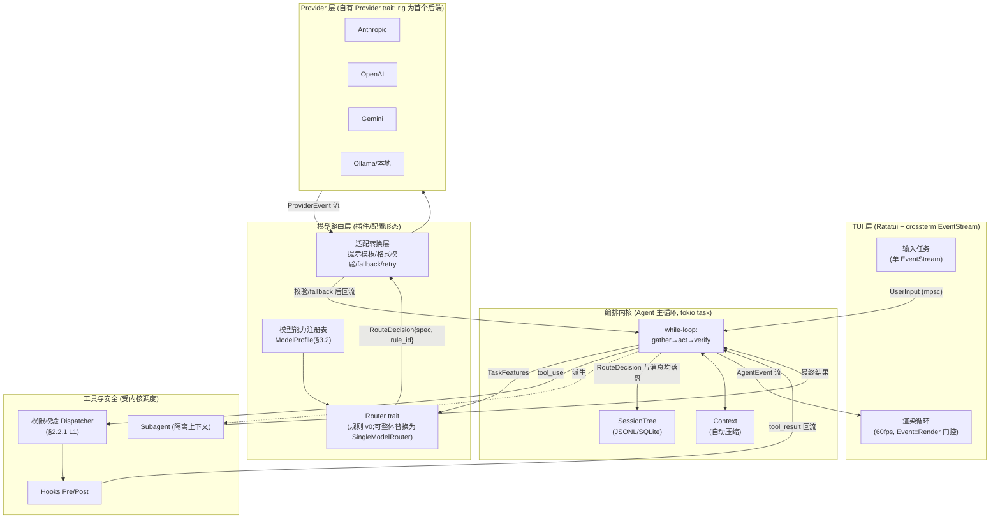

# 核心规格:基于 pi 理念的 Rust 终端编码 Agent(智能 Harness)

> 本文档是项目核心规格(spec)。收录标准:**每条规范性内容必须能写出"先失败的测试(或可执行检验)+ 明确通过条件"**。
> 不满足此标准的内容,按处置分流:有潜在价值的未验证想法 → [FUTURE.md](FUTURE.md)(未来特性登记册,未承诺);描述不足以裁定的 → §9 待裁定项(非规格);应舍弃的 → 变更摘要中列明理由。
> 调研原文与全部证据链存档于 [report_v1.md](report_v1.md),本文引用不再重复其推导过程。

---

## 变更摘要

### 第二轮:A/B/C 隔离修订(本轮)

**移入 FUTURE.md(C 类,有潜在价值但未验证):**

| 条目 | 原位置(v2 首版) | 移出理由 |
|---|---|---|
| F1 智能路由有效性假设(H1)+ 决策门协议 | §0 TL;DR、§3.3.2、§8.1 | 唯一证据(RouteLLM)全部来自对话类 benchmark,编码 agent 域零实践支撑;90%/50% 阈值为未校准拍板值;决策门实验自身缺 benchmark 接入层与统计效力分析。今天写不出先失败的测试 |
| F2 学习型路由(RouteLLM 式训练管线) | §0.2、§3.3.2、§7.2.6 | 训练数据来源不存在,管线零设计——缺的不是描述而是前提 |
| F3 模型能力在线探针 | §3.2 填充策略第 3 项、§7.2.1 | code_gen 探针无任务集/评分法/样本量,小样本实测能力的信度无支撑;latency 子项低风险,随 F3 一并登记 |
| F4 语义验证(LLM 评审员) | §2.1 verify 定义内 | LLM-as-judge 在编码任务的信度无数据、零规格;原位置使其与机械验证并列,构成误导 |

**舍弃(不进 FUTURE.md):**

| 条目 | 原位置(v2 首版) | 舍弃理由 |
|---|---|---|
| 「定期假设审计」作为防过时**机制** | §3.5.4 | 不可证伪的过程信念(审计了照样可能过时)。其中可测部分——`rationale`/`as_of` 字段与超期标黄——保留在 §3.2/§3.5;"审计防过时"的效果主张删除 |
| 设计信条群:「harness 质量将成为主要差异化」、1.6%/98.4% 的方向性引申、「死守极小内核是防复杂度失控的唯一保障」 | §2.1、§7.1 | 不可证伪,且以缓解措施/结论的姿态与可验证内容并列。调研原文仍在 report_v1.md 存档;§7.1 复杂度行现在只保留两条可机检的 CI 防腐测试 |

**为保持可验证性而做的裁定(可复议):**

| 裁定 | 内容 |
|---|---|
| 能力分改离散档位 | `ModelProfile` 的 reasoning/code_gen 从 `f32` 序数值改为 `CapabilityTier{Low,Mid,High}`——消除"声明序数、却用 `≥0.7` 基数阈值"的语义矛盾,使规则表可测(§3.2) |
| 路由决策记录去掉难度分/预估成本 | `RouteDecision` 改为 `{task, spec, rule_id}`;成本显示改用 `Usage` 事件累加的**实际**花费(可测)。"预估成本降档"因估计方法未定义,降为待裁定 D2 |
| 预算机制只保留硬上限 | 累计实际花费 ≥ 会话预算 → 挂起询问(可测);预估性强制降档 → D2 |
| 插件"热替换"降级为"配置外置、重载生效" | 前者机制未选(dylib/WASM/重载),后者平凡可测;真·运行时热插件 → D3 |
| H3 措辞收窄 | 「足以防止逃逸」(全称,不可测)→「已知对抗用例集 0 逃逸」(可测,§2.2.1) |
| `TaskKind` 拆分 | 枚举类型与路由函数契约保留(可测);**kind 的生产环境判定状态机**未定义且与极小内核哲学有张力 → D1。MVP 中机械可判定的仅 `Summarize`(内核自发任务)与 `failed_attempts` 升档 |
| 魔法数字集中 | 全部散落阈值收入 §10 待标定参数表,统一标注「未经校准的可配置默认值」 |

### 第一轮:v1 → v2 规格化(存档)

术语表消除「Harness」双义;统一 `ProviderEvent`/`AgentEvent` 命名;Provider trait 定为自有抽象(rig 为首个后端);补齐路由器输入端类型;sandbox 分级定义;verify 操作性定义;MVP 各步增加先写测试与验收标准。详细对照见 git 历史或 report_v1.md。

---

## 0. 一页摘要(TL;DR)

| 维度 | 结论 |
|---|---|
| **可行性** | 高。pi 四包单仓架构(pi-ai / pi-agent-core / pi-coding-agent / pi-tui)直接映射目标分层。Rust 移植 `pi_agent_rust`(v0.1.18, 2026-06)可参考;**能否 fork 取决于其许可证,列为行动项 #0**。 |
| **架构范式** | 「推理/执行分离」+「极小内核 + 全部能力外置」,均为模型无关、有生产先例(pi、Claude Code)的可复刻设计。 |
| **差异化定位** | 按 query 在线模型路由是竞品空白(§5 证据)。**其有效性未验证,登记为 [FUTURE.md F1](FUTURE.md);本规格承诺的是可验证的路由机制**(规则引擎、可替换性、决策可见),不承诺其成本/质量收益。 |
| **TUI 选型** | **Ratatui**(总下载 17.63M,v0.30.0 / 2025-12,活跃多维护者)。Cursive 停滞(2024-08),tui-realm 近期下载约为 Ratatui 的 1/173(社区规模差距的代理指标)。 |
| **LLM 后端** | **自有 `Provider` trait 为唯一抽象**;rig(20+ 厂商,流式+工具,有生产用户)作第一个后端实现,genai 作对照。 |
| **第一步** | `Provider` trait + 单模型 agent 主循环,流式接入 Ratatui 事件循环。约 1–1.5 人周见首个端到端 demo。 |

### 0.1 术语表(全文按此使用)

| 术语 | 定义 | 边界 |
|---|---|---|
| **pi 理念** | 四条可操作原则:① 极小内核(4 工具 + 最短系统提示);② 能力经 Extension 扩展且状态可持久化进 session;③ 树状 session(id/parentId,分支/rewind/摘要回注);④ 模型无关为一等公民(provider factory + compat flags) | 见 §1;不含 pi 的具体实现细节 |
| **智能 Harness(广义,本项目)** | 模型之外的**全部**确定性运行时:编排内核 + 模型路由层 + Provider 层 + 工具执行与安全层 + session/上下文管理 | 对应 Claude Code 语境中的 "harness" |
| **编排内核(Kernel)** | agent 主循环(gather→act→verify)、SessionTree、上下文压缩。**不含**任何模型专属常量、路由规则、提示模板 | 内核只依赖 trait:`Provider`、`Tool`、`Router` |
| **模型路由层(Router)** | 模型能力注册表 + 路由决策 + 适配转换(模板/校验/fallback)。本规格只定义其**机制**;路由**策略的收益**属 FUTURE F1 | 以插件/配置形态存在,可整体替换为 `SingleModelRouter` 空实现 |
| **Provider 层** | `Provider` trait 及各厂商后端实现 | 模型专属格式差异全部在此层吸收 |
| **`ProviderEvent`** | Provider → 内核的流式事件枚举 | 定义见 §4.3 |
| **`AgentEvent`** | 内核 → TUI 的事件枚举 | 定义见 §4.3 |
| **`TaskKind`** | 路由函数的输入标签(枚举类型) | 类型见 §3.3.1;生产判定机制为待裁定 D1 |

### 0.2 非目标(MVP 明确不做)

1. **Web/WASM 前端**:交互层仅 TUI。内核经 `AgentEvent` 与 TUI 解耦,未来接其它前端只需替换事件消费端,本期不设计。
2. **学习型路由器**:见 [FUTURE.md F2](FUTURE.md)。
3. **进程级 OS sandbox(L2)**:MVP 安全边界是 L1 权限 dispatcher(§2.2.1);L2 为待裁定 D5。
4. **多用户/远程/团队协作**:单机单用户。
5. **语义验证(LLM 评审员)**:见 [FUTURE.md F4](FUTURE.md)。

### 0.3 规格边界原则(宪章摘录;完整条款见 [CONSTITUTION.md](CONSTITUTION.md))

1. **[FUTURE.md](FUTURE.md) 中的任何内容不得进入实现。** 唯一例外路径:按该条目的「毕业标准」补齐证据 → 提升为本规格的正式条目 → 通过 spec-reviewer 评审。三步缺一不可(宪章 1.2)。
2. 本规格只收录能写出「先失败的测试 + 通过条件」的内容;新增内容不满足此标准时,分流至 FUTURE.md(有潜在价值)、§9 待裁定项(缺件待补)或舍弃(记入变更摘要)(宪章 3.2)。
3. 本规格是唯一规范性 spec;文档层级与变更流程见宪章第 7 章。

---

## 1. pi 架构剖析与可映射的设计原则

### 1.1 架构事实(主源验证)

pi 是**四包单体仓库**(`pi-monorepo`, `workspaces: packages/*`),README 头即 `## Pi Agent Harness`:

| 包 | 职责 | 映射到目标分层 |
|---|---|---|
| `pi-ai` | 统一多厂商 LLM API(74 个 TS provider 文件 + 形式化 `ProviderStreams` 统一流接口) | **Provider 层** |
| `pi-agent-core` | Agent 运行时:工具调用 + 状态管理 | **编排内核** |
| `pi-coding-agent` | 交互式编码 CLI | **应用层** |
| `pi-tui` | 终端 UI(差分渲染) | **TUI 层** |

来源:`github.com/earendil-works/pi`、`lucumr.pocoo.org/2026/1/31/pi/`(Armin Ronacher 解析)。

### 1.2 "轻量"的本质

- **极小内核**:「已知 agent 中最短的系统提示」,**仅 4 个工具 Read/Write/Edit/Bash**。
- **扩展系统补偿**:能力靠 extension 扩展,且 extension 可把状态持久化进 session。
- **树状 Session**:消息带 `id/parentId`,支持分支/导航/侧任务——在分支里修好坏掉的工具,再 rewind 并把分支摘要注回主线(`branch_summary` 注入)。
- **模型无关是一等公民**:一个 session 可包含来自多个厂商的消息;请求经 **provider factory** 用 `(provider, model, api)` 三元组解析后端;用户在 `models.json` 自定义 provider;compat 配置吸收 OpenAI 兼容差异(`system_role_name`、`max_tokens_field`、`supports_tools`、`supports_streaming`、`custom_headers`)。

### 1.3 局限性(本项目要补的点)

1. **无在线能力路由**:`(provider, model, api)` 是用户/会话级选择;pi 把「选哪个模型」留给用户。
2. **节点流没有「在节点间插入路由决策」的内建抽象**——本项目补的机制增强点。
3. **`/tree` 仅回滚对话状态,不回滚文件系统改动**——真隔离的 side-quest 需另加快照/沙箱(待裁定 D4)。

### 1.4 映射为 Rust 内核的设计原则

| pi 理念 | Rust 落地原则 |
|---|---|
| 极小内核 + 扩展 | `Tool` trait + `Extension` trait;核心只保留 4 工具,其余动态注册 |
| 模型无关 + factory + compat | `Provider` trait + `ModelSpec{provider,model,api,compat}` + `models.json` 反序列化(serde) |
| 统一流接口 ProviderStreams | `Provider::stream() -> mpsc::Receiver<ProviderEvent>`(§4.3) |
| 树状 session | `SessionTree`(节点 `id/parent_id` + active leaf),SQLite/JSONL 持久化 |
| 状态可持久化进 session | 扩展状态序列化进节点元数据 |

---

## 2. 编排内核规格(源自 Claude Code 范式解构)

### 2.1 主循环

- **简单 while-loop**:调模型 → 解析 tool_use → 权限校验 → 执行工具 → 追加结果 → 检查停止条件,全程可取消(tokio task)。来源:`code.claude.com/docs/en/how-claude-code-works`、`.../agent-sdk/agent-loop`、`arxiv.org/html/2604.14228v1`。
- **三阶段**:gather context → take action → verify results,可重复、可人为中断。
- **verify 的操作性定义(本规格)**——机械验证:
  - Edit 后重读目标区域确认应用成功;
  - Bash 命令以退出码判定;
  - 任务声明了验证命令(如 `cargo test` / `cargo check`)时,其退出码即该任务的通过判据。
  - (语义验证不属本规格,登记于 [FUTURE.md F4](FUTURE.md)。)

**验收**:mock Provider 注入固定事件序列 → 断言循环按序消费、工具结果回流、可中途取消且不 panic。

### 2.2 安全:推理与执行分离

模型**从不直接访问** FS/shell/network,只发 `tool_use` 块,由运行时校验+派发——推理与执行占据不同代码路径,是模型无关的可复刻设计(arXiv 原文论证;CVE-2025-59536 利用的是信任初始化窗口,非模型越权,架构论点成立)。

#### 2.2.1 L1 权限 dispatcher(MVP 安全边界)

| 规则 | 内容 |
|---|---|
| 文件路径白名单 | 默认仅工作区根以下;拒绝符号链接逃逸与 `../` 穿越 |
| Bash 命令 | 须经 allowlist/询问策略 |
| 网络 | 默认拒绝(MVP 工具集无网络工具) |
| deny-first | 未匹配规则一律询问或拒绝 |

**可验证规格**:每条规则是纯函数 `fn check(&PermissionPolicy, &ToolCall) -> Allow|Deny|Ask`,表驱动单测穷举(路径逃逸、`../`、符号链接、命令注入样例)。**安全验收(原 H3,范围收窄)**:维护一个对抗性提示注入用例集(诱导写工作区外路径/执行未授权命令),**已知用例集 0 逃逸**为通过条件;用例集随新攻击样式持续扩充。

L1 **不防**恶意本地进程;OS 级隔离(L2)未承诺,见待裁定 D5。

### 2.3 工具执行与上下文管理

- **并行只读 / 串行写**:只读工具并发执行(`tokio::join!`);改状态工具(Edit/Write/Bash)强制串行;自定义工具默认串行,除非标 `readOnlyHint`。**验收**:一次含 2 读 1 写的模拟回合,以执行时间线断言"读并发、写在读后串行"。
- **权限层 + Hooks**:`PreToolUse`/`PostToolUse` hook 运行在模型上下文之外,可拦截/改写/阻断任意工具调用。**验收**:hook 注册后断言其拦截生效。
- **自动压缩**:`used_tokens / context_window ≥ 阈值 P1` 时触发;保留系统提示、最近 N 轮完整消息与所有未完成工具调用,更早历史替换为单条摘要节点。**验收(机械判据)**:压缩后 token 占用 ≤ P2,且未完成的 tool_use/tool_result 配对不被拆散。(P1/P2/N 见 §10 参数表;摘要的语义保真无机械判据,有意不作规格。)
- **子 agent 隔离**:spawn 独立 agent-loop task,仅返回最终 tool-result 给父级。**验收**:父级上下文只增加最终结果,不含子 agent 转录。

### 2.4 耦合度分界

| 能力 | 耦合度 | 处置 |
|---|---|---|
| while-loop / 推理执行分离 / 并行只读串行写 / Hooks / 自动压缩 / 子 agent | **通用** | 进内核规格(上文) |
| 具体系统提示、tool_use 块的厂商格式 | **强耦合** | 由 Provider 适配层吸收(compat flags),不进内核 |

### 2.5 Managed Agents 三层虚拟化(防模型锁定骨架)

Anthropic「Managed Agents」:session(追加式事件日志)/ harness(调模型+路由工具调用的循环)/ sandbox(执行环境)各自虚拟化,可独立替换。本项目落地为三个 trait 边界,验证方式见 §3.5 的 CI 防腐测试。

---

## 3. 模型路由层规格(机制;策略收益见 FUTURE F1)

### 3.1 总体架构(Mermaid)



### 3.2 模型能力画像与注册

```rust
enum ProfileSource { Static, VendorApi }
enum CapabilityTier { Low, Mid, High }   // 离散档位:同一注册表内比较,不承载测量语义

// Sourced<T> = { value: T, source: ProfileSource, as_of: Date, provenance: String /* 出处 */ }
struct ModelProfile {
    spec: ModelSpec,                  // (provider, model, api, compat)
    reasoning: Sourced<CapabilityTier>,
    code_gen: Sourced<CapabilityTier>,
    context_window: Sourced<u32>,     // 通常 source = VendorApi
    cost_in: Sourced<f32>, cost_out: Sourced<f32>,   // $/Mtok
    supports_tools: bool,
    supports_streaming: bool,
}
```

**填充策略(bootstrap 顺序固定):**
1. **静态配置兜底(MVP,必有)**:`models.json` 手填,每项标注 `provenance`(依据的公开 benchmark 或厂商文档出处)。路由器在只有静态画像时即须可用。
2. **provider 元数据查询**:上下文窗口、工具支持等从 provider API/已知表读取,覆盖同名静态字段。
3. (在线探针不属本规格,登记于 [FUTURE.md F3](FUTURE.md)。)

**保鲜(机械部分)**:每条画像带 `as_of`,超期(§10 参数 P5)在路由决策面板标黄提示复核。**验收**:构造过期画像 → 断言面板出现标黄事件。画像与路由规则放在配置中、不进内核,重载生效(真·热替换为待裁定 D3)。

### 3.3 路由函数规格

#### 3.3.1 `TaskKind`(路由输入类型)

```rust
enum TaskKind { Plan, Draft, Refine, ToolFollowup, Summarize }

struct TaskFeatures {
    prompt_tokens: u32,
    ctx_files: u32,
    has_code: bool,
    failed_attempts: u8,   // 本任务已失败验证次数(§2.1 机械验证判定)
    kind: TaskKind,
}
```

**规格边界(重要)**:本节定义的是**类型与路由函数契约**——给定任意 `TaskFeatures`,路由行为完全确定、可测。**kind 在生产环境如何判定**是另一问题:MVP 中机械可判定的仅两类——`Summarize`(内核自发的压缩/摘要任务,内核直接标注)与 `failed_attempts`(机械验证失败计数);`Plan`/`Draft`/`Refine` 的自动判定需要一个尚未定义的工作流状态机,且与极小内核哲学存在张力,**列为待裁定 D1**。D1 裁定前,非内核自发任务默认 `ToolFollowup`,用户可显式指定 kind(如命令前缀),两者均机械可测。

#### 3.3.2 v0 规则表(默认 RuleSet;参数见 §10)

| 规则 | 决策 |
|---|---|
| R1:`kind == Summarize` | 成本最低且 `supports_streaming` 的模型 |
| R2:`kind == Draft && prompt_tokens < T1 && ctx_files <= T2 && failed_attempts == 0` | `code_gen >= Mid` 档中成本最低者 |
| R3:`kind == Draft && (prompt_tokens >= T1 || ctx_files > T2)` | `code_gen == High` 档中成本最低者 |
| R4:`failed_attempts >= 1`(任意 kind) | **升档**:比当前模型 code_gen 高一档;已是 High 则维持并发告警事件 |
| R5:`kind == Plan || kind == Refine` | `reasoning == High` 档中成本最低者 |
| R6:选出的模型 `!supports_tools` 且任务需要工具 | 走适配层 system-message tools 路径(§3.4),或 fallback 到最近的 `supports_tools` 模型 |

**路由器签名**:`fn route(&RuleSet, &Registry, &TaskFeatures) -> RouteDecision`,其中 `RouteDecision { spec: ModelSpec, rule_id: RuleId }`——纯函数。
**验收**:上表逐行 → 表驱动单测;边界用例:阈值恰好相等、空注册表、全部 `!supports_tools`、R4 升档链到顶。每个决策以 `AgentEvent::RouteDecision` 上报面板并写入 SessionTree 与 tracing 日志(可断言)。

> 本节承诺的是「路由器忠实执行规则表」。**规则表能否在真实编码任务上省成本保质量,是未验证假设,登记于 [FUTURE.md F1](FUTURE.md);毕业前不得在任何对外表述中作为结论引用。**

### 3.4 适配转换层

| 机制 | 实现 | 可测试规格 |
|---|---|---|
| 提示模板转换 | 每 ModelSpec 绑定模板(借鉴 DSPy Adapter:同一 Signature 渲染成 Chat/JSON/XML) | 同一逻辑请求 × N 模板 → 快照测试(insta) |
| 输出格式校验 | serde + JSON schema 校验;失败触发 retry/fallback | 畸形输出样例集 → 断言进入 retry 分支 |
| fallback/retry | 格式不符/调用失败 → 降级到兜底模型;**同一任务最多 P4 次 fallback,之后挂起等用户** | mock provider 连续失败 → 断言终止于用户询问而非死循环 |
| 工具调用兼容 | system-message tools(借鉴 Continue):无原生 function-calling 的模型,把工具序列化成 XML 进系统提示再解析 | 往返测试:ToolDef → XML → 解析回 ToolCall 等价。⚠️ 往返测试只证编解码自洽;真实弱模型的输出遵从率未验证,见待裁定 D6 |

### 3.5 防"路由层成为新的模型强绑定"(可机检)

1. **路由规则、提示模板、能力画像全部外置**为配置,内核不含模型专属常量。**CI 防腐测试 ①**:以 `SingleModelRouter`(恒定返回一个模型的空实现)替换 Router,跑全部内核测试——通过即证明内核不依赖路由层。
2. **Provider trait 是唯一出口**。**CI 防腐测试 ②**:新增一个 mock 厂商仅通过 `models.json` 完成接入的集成测试。
3. 每条路由规则/提示模板带 `rationale` 与 `as_of` 字段,超期触发面板提示(机械可测,同 §3.2)。

---

## 4. Rust TUI 交互层规格

### 4.1 选型(主源 crates.io 数据)

| 库 | 下载量(总/近期) | 最新版/日期 | 模型 | 结论 |
|---|---|---|---|---|
| **Ratatui** ✅ | 17.63M / 5.37M | v0.30.0 / 2025-12-26 | 即时模式,用户自管事件循环 | 采用:唯一大型活跃社区;即时模式+双缓冲差分对流式 token 最友好;官方 async 惯用法文档化 |
| Cursive | 1.47M / 232K | v0.21.1 / 2024-08-03 | 保留模式,内建事件循环 | 排除:已停滞;内建循环抽象掉了流式更新所需的控制权 |
| tui-realm | 180K / 31K | v4.0.0 / 2026-04-18 | Elm/MVU(叠在 ratatui 上) | 可选叠加层,非必需 |

### 4.2 TUI 布局

```
┌─ seekcode ───────────────────────────── model: auto │ ctx: 42% ─┐
│ ┌─ 对话流 ────────────────┐ ┌─ 任务/子任务步骤 ──────────────┐ │
│ │ user: 重构 auth 模块     │ │ ▸ 1. 读取 auth.rs   ✔          │ │
│ │ agent: 我先读取……       │ │ ▸ 2. 生成改动 [R2:haiku]      │ │
│ │ ▎(流式 token……)         │ │ ▸ 3. 修复失败 [R4:opus] ◐     │ │
│ └─────────────────────────┘ │ ▸ 4. 跑测试        ⋯          │ │
│ ┌─ 工具调用日志 ──────────┐ └────────────────────────────────┘ │
│ │ Read(auth.rs) ✔ 0.2s    │ ┌─ 模型路由决策 ────────────────┐ │
│ │ Bash(cargo test) ◐      │ │ task#2 R2→haiku   $0.001 实付 │ │
│ └─────────────────────────┘ │ task#3 R4→opus    升档        │ │
│ ┌─ 代码/文件 Diff 预览 ───────────────────────────────────────┐ │
│ │  - fn login(u,p) {            + fn login(creds: Creds) {     │ │
│ └─────────────────────────────────────────────────────────────┘ │
│ > 输入指令…                                          [Ctrl+C 取消] │
└──────────────────────────────────────────────────────────────────┘
```

五大区:对话流 / 任务步骤树 / 工具调用日志 / Diff 预览 / **模型路由决策面板**(展示 `RouteDecision`:命中的规则、选定模型、`Usage` 事件累加的实际花费)。
**验收**:Ratatui `TestBackend` 快照测试——给定 `AgentEvent` 序列,断言各面板渲染缓冲。

### 4.3 异步事件协调与事件类型定义

**两个事件枚举(接口契约,第一步定型):**

```rust
/// Provider → 内核(经适配层)
enum ProviderEvent {
    TextDelta(String),
    ToolUse { id: ToolCallId, name: String, args_json: String },
    Usage { in_tokens: u32, out_tokens: u32 },
    Done(StopReason),
    Error(ProviderError),
}

/// 内核 → TUI
enum AgentEvent {
    MessageDelta { node_id: NodeId, text: String },
    ToolStatus { call: ToolCallId, state: Running|Ok|Failed, elapsed: Duration },
    RouteDecision { task: TaskId, spec: ModelSpec, rule_id: RuleId },
    PermissionRequest { call: ToolCallId, reply: oneshot::Sender<Decision> },
    ContextUsage(f32),
}
```

**核心三规则(防死锁):**
1. **Terminal 单一所有者**:`terminal.draw()` 是唯一同步边界,一个循环迭代只调一次。
2. **一切跨任务通信走 mpsc/oneshot**,绝不在 Terminal 上共享可变状态。
3. **后台工作(LLM 流式、子 agent)是分离 tokio task**,只通过消息回 UI。

**惯用模式(官方教程 + claux 实证):**
```rust
// 事件源 task:tokio::select! 多路复用
tokio::select! {
    maybe_event = crossterm_event => { tx.send(Event::Key(..)) }
    _ = tick_interval.tick()   => { tx.send(Event::Tick) }    // 1 Hz
    _ = render_interval.tick() => { tx.send(Event::Render) }  // 60 fps
}
// 主循环:仅 Event::Render 触发 terminal.draw()

// 内核消息消费:
tokio::select! {
    Some(ev) = provider_rx.recv() => match ev {
        ProviderEvent::TextDelta(t) => { app.buf.push_str(&t); /* 置脏标记 */ }
        ProviderEvent::ToolUse{..}  => { /* 派发到权限 dispatcher */ }
        ProviderEvent::Done(_)      => break,
        _ => {}
    },
    Some(ev) = agent_rx.recv() => { /* AgentEvent → 面板状态 */ }
}
// 权限提示:内核阻塞在 PermissionRequest 的 oneshot 上,直到 TUI 回答
```

> ⚠️ crossterm 的阻塞 `read()/poll()` 非线程安全、不可与 EventStream 混用(官方文档)。**所有终端输入必须经单个 EventStream。**

**验收**:仅 `Event::Render` 触发 draw(计数器断言);流式期间输入不阻塞(时间线断言);`PermissionRequest` oneshot 往返测试。

可选 Elm 叠加层:boba / tears / tui-realm。pi_agent_rust 的 mpsc + 事件变体 + 60fps + 三级 MemoryMonitor(<80% / 80-95% 折叠工具输出 / >95% 截断)模式可直接搬到 Ratatui,各级阈值行为均可单测。

---

## 5. 竞品对比(差异化定位的证据基础)

**调研事实:以下 7 个工具无一具备「按 query 在线、能力感知的模型路由」,全部是设计期静态绑定。** 此事实只证明"没人做过",不证明"做了有效"——有效性假设登记于 [FUTURE.md F1](FUTURE.md)。

| 工具 | 多模型机制 | 是否在线能力路由? | 根本差异 |
|---|---|---|---|
| **Aider** | architect/editor 两模型 + weak-model 辅助 | ❌ 静态 `ModelSettings` 表 | 流水线固定;动态的只是 repo-map 上下文选择,非模型路由 |
| **Continue** | config.yaml 静态绑 roles | ❌ 硬编码 per-provider 查找表 | "路由"外包给外部 provider;能力声明只能加不能覆盖 |
| **Open Interpreter** (Rust) | 可插拔 harness 模板,`/harness` 手动切 | ❌ 手动切换 | **理念最接近**,值得参考其 harness 模板;但无自动路由 |
| **DSPy** | `dspy.LM` 统一抽象,per-module `set_lm()` | ❌ 手动赋值 | 智能在优化期(提示编译),非在线选模 |
| **LangChain/LangGraph** | conditional edges | ❌ 开发者手写路由函数 | 提供管道,不提供路由器 |
| **AutoGen** | `config_list` 位置式 failover | ❌ 失败才换下一个 | Selector 路由的是发言 agent,不是模型 |
| **CrewAI** | 每 agent 构造期一个 `llm` | ❌ 功能划分非难度划分 | 无"是否升级到更强模型"的步骤 |

来源与完整论证见 report_v1.md §5。

---

## 6. 技术栈与 MVP 路线图

### 6.1 技术栈

| 关注点 | 推荐 | 说明 |
|---|---|---|
| Provider 抽象 | **自有 `Provider` trait**;首个后端 rig (v0.36.0),genai (v0.6.0) 对照后定其一 | rig 自警破坏性变更 → 只出现在实现侧,内核零依赖 |
| 异步运行时 | tokio(select!/spawn/mpsc/oneshot) | |
| TUI | ratatui + crossterm(event-stream);`tui-textarea` 多行输入 | §4 |
| 配置 | serde + figment/config + `models.json` | compat flags / 画像反序列化 |
| 持久化 | rusqlite(SQLite) 或 JSONL | 树状 session,pi_agent_rust 同款双轨 |
| 日志 | tracing + tracing-subscriber | 路由决策、token 用量结构化日志 |
| 错误 | thiserror(库)+ anyhow(应用) | |
| Diff | similar | |
| 测试 | cargo test + insta(快照)+ wiremock/mock provider | §6.2「先写测试」列 |

排除项:`async-openai`(仅 OpenAI)、`llm`(已归档)、`kalosm`(云覆盖小);`mistral.rs` 是推理引擎(被消费对象),非 provider 抽象。

### 6.2 MVP 分步计划(每步先写测试,红→绿)

| 步 | 模块 | 内容 | 先写测试(TDD 入口) | 验收标准 | 工作量 |
|---|---|---|---|---|---|
| **1** | Provider trait + 单模型循环 | `Provider::stream()`;接 rig 单厂商;最小 while-loop;流式接入 Ratatui | mock Provider 发 `TextDelta×N + Done` → 断言按序消费、可取消;`ProviderEvent` 序列化快照 | 真实厂商流式回答在 TUI 逐字渲染;Ctrl+C 取消不 panic | 1–1.5 周 |
| 2 | 工具 + 权限 dispatcher | `Tool` trait(4 工具)+ 并行只读/串行写 + hooks | §2.2.1 表驱动测试(路径逃逸/symlink/deny-first);读写时间线断言 | 2 读 1 写回合:读并发、写串行;越权被拒;对抗用例集 0 逃逸 | 1 周 |
| 3 | TUI 五区布局 | 五区 + 60fps 渲染门控 | `TestBackend` 快照:给定 `AgentEvent` 序列断言渲染缓冲 | 五区随事件流更新;仅 Render 触发 draw(计数器) | 1–1.5 周 |
| 4 | 多 Provider + compat | `models.json` + factory + compat flags;2-3 厂商(含 Ollama) | 反序列化用例集(含非法配置);compat flag 逐项行为测试 | mock 厂商仅改配置接入(CI 防腐 ②) | 0.5–1 周 |
| 5 | 规则路由器 + 画像 | `ModelProfile` 静态注册 + v0 规则表 + 决策面板 | §3.3.2 逐行表驱动测试 + 边界用例 | R2 低档 / R4 升档在 mock 上端到端复现;决策进面板与日志;CI 防腐 ① 通过 | 1 周 |
| 6 | 适配/fallback + session | 格式校验 + retry/fallback(上限 P4);SessionTree + 自动压缩 | 畸形输出→retry;连续失败→挂起询问;压缩配对完整性;分支/rewind 往返 | 崩溃后恢复到同一 active leaf;压缩触发于 P1 且降至 ≤P2 | 1–1.5 周 |

> 总计约 **6–8 人周**(注意:**不含** FUTURE F1 毕业实验的 benchmark 接入与执行成本)。**行动项 #0(先于一切):核实 `pi_agent_rust` 的许可证与"授权移植"条款**,再决定 fork 起步还是借鉴重写。

### 6.3 明确的第一步

**`Provider` trait + "单模型主循环 → 流式 token 进 Ratatui"。** 锁定 select! 协调骨架(最高技术风险,先消除);实测定下 rig vs genai;`ProviderEvent`/`AgentEvent` 契约定型。

---

## 7. 风险与缓解

| 风险 | 评估 | 缓解(仅列可验证项) |
|---|---|---|
| Rust LLM 生态成熟度 | 中 | Provider trait 自有抽象 + pin 版本 + CI 防腐 ② |
| 异步 TUI 死锁/卡顿 | 中→低 | §4.3 三规则 + 单 EventStream;渲染门控计数器测试 |
| 多模型切换的安全 | 中 | 任何模型的 tool_use 都过同一 L1 dispatcher;对抗用例集 0 逃逸(§2.2.1) |
| 成本失控 | 中 | 面板显示 `Usage` 累加实付;**硬性预算上限**:累计实际花费 ≥ 会话预算(§10 P6)→ 挂起询问(可测)。预估性降档为待裁定 D2 |
| 被否决论断误用 | — | 不引用"3.66x 单模型节省"(调研中 0-3 否决);RouteLLM 数字仅出现在 FUTURE F1/F2 并带域外警示 |
| 复杂度失控 | 高 | 内核依赖仅三 trait;CI 防腐 ①② 使"新能力默认进插件"可机检 |

---

## 8. 行动序列

0. **行动项 #0(本周,先于编码)**:核实 `pi_agent_rust` 许可证;克隆通读,决定 fork 还是借鉴重写。
1. **本周**:§6.3 第一步——Provider trait + 单模型主循环 + Ratatui 流式 demo。
2. **第 2-3 周**:工具 + L1 dispatcher(含对抗用例集)+ TUI 五区。
3. **第 4-5 周**:多 Provider + compat + v0 规则路由器 + 画像,路由决策面板可见。
4. **第 6-8 周**:适配/fallback + session 持久化,补齐 §6.2 全部验收标准。
5. **MVP 完成后**:若要启动 [FUTURE F1](FUTURE.md) 毕业实验,先补齐其前置缺件(benchmark 接入层、统计方案、预算)——**在 F1 毕业前,智能路由对外只称"机制可用",不称"省成本保质量"**。
6. **架构纪律**:每加一个能力先问"进内核还是进插件?"默认进插件,由 CI 防腐 ①② 机检。

---

## 9. 待裁定项(非规格——不得据此实现,裁定后按 §0.3 流程入规格)

| # | 事项 | 缺什么才能裁定 |
|---|---|---|
| D1 | `TaskKind` 中 `Plan`/`Draft`/`Refine` 的自动判定状态机 | 状态机定义本身;并须先解决张力:判定逻辑进内核(违背极小内核)还是进插件(插件如何看到循环状态)。裁定前:内核只标 `Summarize` 与 `failed_attempts`,其余默认 `ToolFollowup` 或用户显式指定 |
| D2 | 预估成本的预算降档 | 输出 token 未知时的估计方法定义;当前只承诺累计实付硬上限 |
| D3 | 插件真·热替换(运行时) | 机制选型:dylib / WASM 插件 / 仅配置重载。当前规格仅承诺"配置外置、重载生效" |
| D4 | side-quest 文件系统隔离 | 机制选型:git worktree / 文件快照 / overlay;及是否进 MVP 后首个里程碑 |
| D5 | L2 OS sandbox 平台矩阵 | Linux(landlock/bwrap)成熟;macOS sandbox-exec 已弃用需替代方案;Windows 无轻量对等物。需平台支持范围决策 |
| D6 | system-message tools 对真实弱模型的鲁棒性 | 真实模型上的解析失败率数据与重试预算;往返测试(§3.4)只证编解码自洽 |

## 10. 待标定参数表(全部为未经校准的可配置默认值)

| 参数 | 默认值 | 用处 | 标定途径 |
|---|---|---|---|
| T1 | 4000 tokens | R2/R3 规则的 prompt 规模阈值 | F1 毕业实验回归 |
| T2 | 2 files | R2/R3 规则的涉及文件数阈值 | 同上 |
| P1 | 0.8 | 自动压缩触发占比 | 实际会话数据 |
| P2 | 0.5 | 压缩后目标占比 | 同上 |
| N | 待定 | 压缩保留的最近完整轮数 | 同上 |
| P4 | 2 次 | 同一任务 fallback 上限 | 运行数据 |
| P5 | 90 天 | 画像 `as_of` 过期阈值 | 模型发布节奏 |
| P6 | 待定 | 会话预算硬上限 | 用户配置,无默认承诺 |

## 11. 证据保留项(caveats)

- pi_agent_rust 用 charmed_rust(Bubble Tea 的 Rust 重写),非 Go bubbletea。
- 本报告的调研方法(两轮 106+89 子 agent、3 票验证制)过程记录未归档,"3-0"标注仅作内部置信度参考;关键结论均附主源链接供直接查证。
- 版本时效:pi_agent_rust v0.1.18(2026-06)、rig v0.36.0、genai v0.6.0、ratatui v0.30.0、crates.io 下载量均为调研日数据,pin 前需复核。
- RouteLLM 证据的域外性警示随其内容移至 [FUTURE.md](FUTURE.md) F1/F2。

---

### 主要来源
- pi: `github.com/earendil-works/pi`, `lucumr.pocoo.org/2026/1/31/pi/`, `github.com/Dicklesworthstone/pi_agent_rust`
- Claude Code: `arxiv.org/html/2604.14228v1`, `code.claude.com/docs/en/how-claude-code-works`, `.../agent-sdk/agent-loop`, `anthropic.com/engineering/managed-agents`
- 路由: `arxiv.org/abs/2406.18665` (RouteLLM), `lmsys.org/blog/2024-07-01-routellm/`
- 对标工具: aider.chat/docs, docs.continue.dev, github.com/openinterpreter/openinterpreter, dspy.ai, docs.langchain.com, microsoft.github.io/autogen, docs.crewai.com
- Rust TUI/异步: ratatui.rs, crates.io, github.com/2389-research/boba, docs.rs/tears, jakegoldsborough.com (claux), github.com/fortunto2/rust-code
- Rust LLM: github.com/0xPlaygrounds/rig, github.com/jeremychone/rust-genai, github.com/64bit/async-openai, github.com/ericlbuehler/mistral.rs
